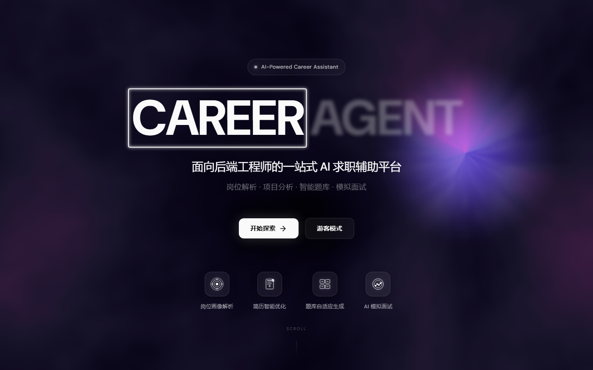
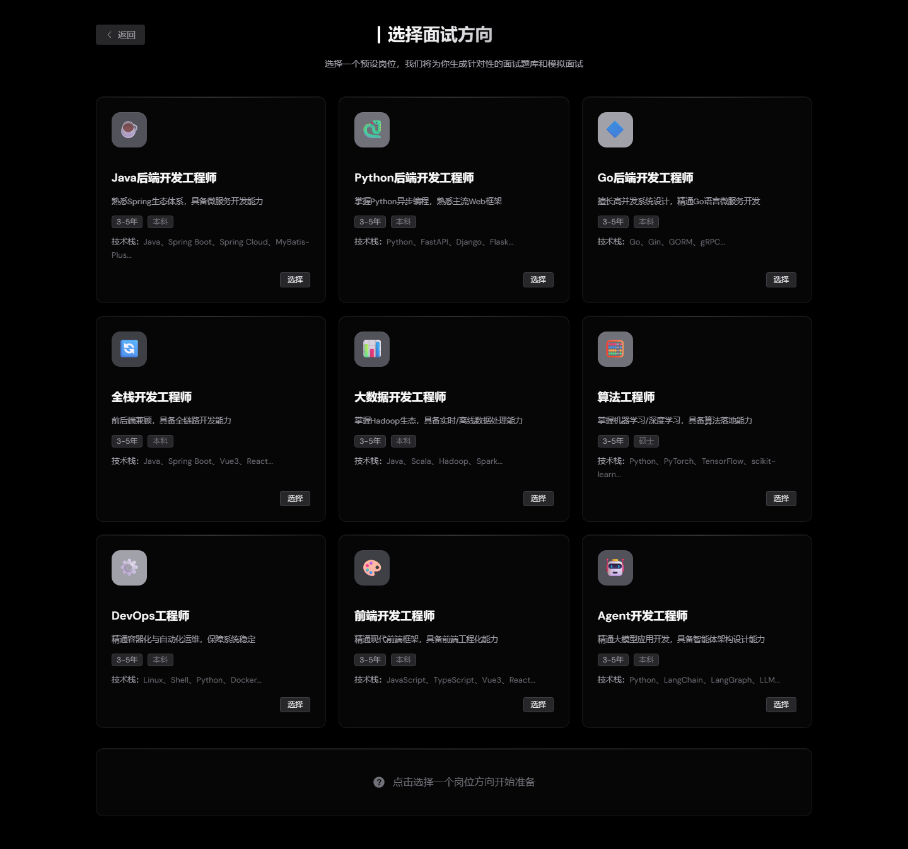
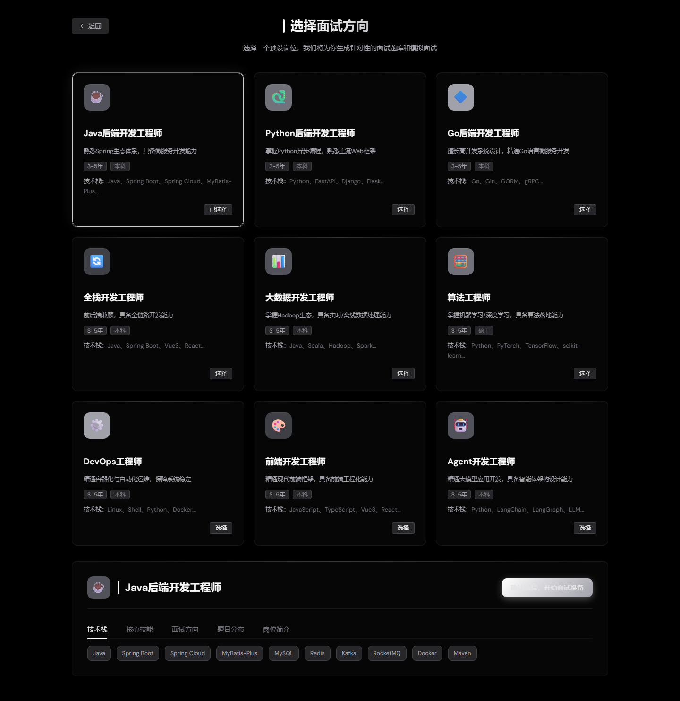
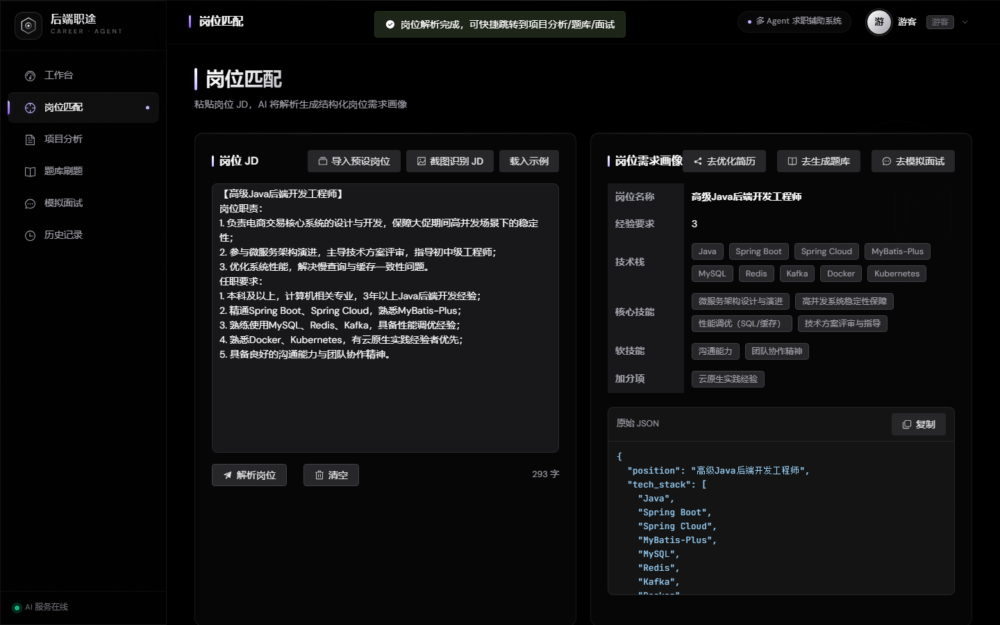
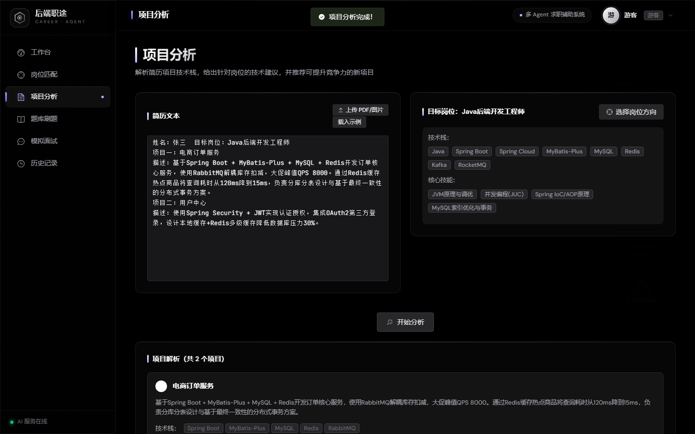
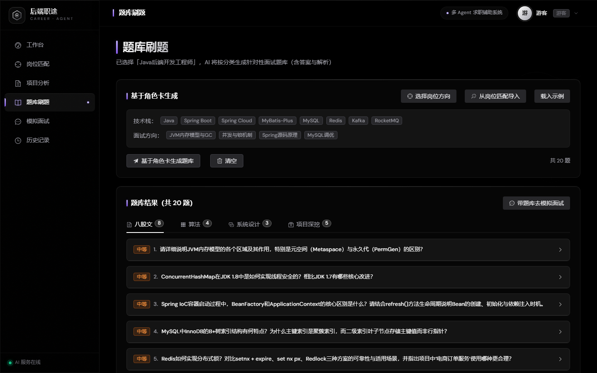
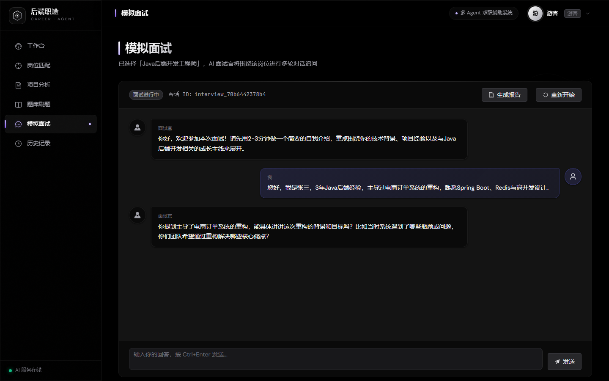
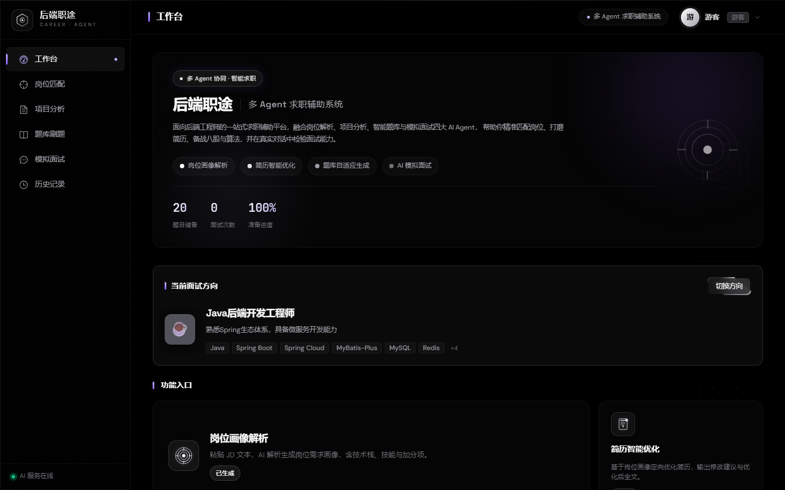
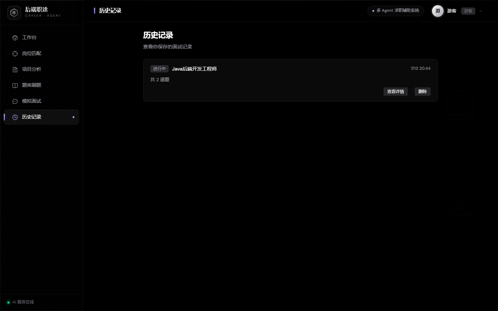

# 后端职途 · 多 Agent 求职辅助系统

<p align="center">
  <strong>面向后端工程师的一站式 AI 求职工作台</strong>
</p>

<p align="center">
  
  
  <a href="http://152.136.232.185"></a>
</p>

---

## 一句话介绍

基于 **LangGraph 多 Agent 编排** 的后端求职辅助平台，覆盖「岗位解析 → 项目分析 → 智能题库 → 模拟面试」全链路，让每一位 Java / Python 后端求职者拥有一支 **7×24 在线的 AI 求职辅导团队**。
注：本项目已部署在http://152.136.232.185（域名备案中），可通过游客模式体验
---

## 🎯 解决了什么痛点

| 痛点 | 现状 | 本项目方案 |
|------|------|-----------|
| JD 信息过载，关键要求难提取 | 人工逐字阅读，耗时且易遗漏加分项 | **岗位匹配 Agent**：粘贴 JD 即刻输出结构化画像（技术栈/经验/核心技能/软技能） |
| 刷题无方向，八股文海战术 | LeetCode/牛客题库与目标岗位脱节，复习效率低 | **题库生成 Agent**：基于目标岗位画像，按八股文/算法/系统设计/项目深挖四类定向出题 |
| 面试无实战环境，紧张导致发挥失常 | 真实面试机会有限，找人模拟协调成本高 | **模拟面试 Agent**：多轮追问式对话（自我介绍→八股→算法→系统设计→项目深挖），结束后生成多维评分报告 |
| 简历/项目经历流水账化 | 缺乏引导式梳理工具，不会用 STAR 法则表达 | **项目分析 Agent**：解析简历中的项目经历，提取技术栈、给出优化建议、推荐可提升竞争力的新项目 |
| 求职资产分散，历史记录难复用 | JD/简历/题库/面试记录散落在不同工具中 | 全模块数据持久化到 localStorage + 工作台 Dashboard 聚合展示，一键回溯 |

---

## 👥 目标用户

- **应届校招生**（0 经验）：快速生成岗位定向题库、包装课设项目、克服面试紧张
- **1–3 年初级工程师**：明确与目标岗位的技能差距、定向刷题、模拟真实面试场景
- **3–5 年中级工程师 / 跳槽者**：JD 驱动精准定位差距、高并发/系统设计专项准备
- **跨方向转型者**（如 Java → Go）：切换预设角色卡即可适配新方向面试重点

---

## 🏗️ 核心功能 & 截图

### 1️⃣ 首页 —— 游客模式免登录体验

支持游客模式直接进入全部 AI 功能模块，无需注册。首页展示产品定位和四大核心能力入口。



---

### 2️⃣ 角色卡系统 —— 零门槛上手 + 微调级个性化

预设 **9 张通用角色卡**（Java/Python/Go 后端、前端、算法、全栈、大数据、DevOps、Agent 开发），覆盖主流技术方向。选择一张卡片即作为后续所有 Agent 的上下文基线。


*9 张预设角色卡，每张包含技术栈、核心技能、面试方向、题目分布权重*


*选中卡片后展开详情面板：技术栈标签 / 核心技能 / 面试方向 / 题目分布柱状图 / 岗位简介*

---

### 3️⃣ 岗位匹配 Agent —— JD 解析为结构化画像

粘贴任意 JD 文本，AI 自动提取：**岗位名称、经验要求、学历、完整技术栈、核心技能、软技能、加分项、关键职责**，并以 JSON 格式输出供下游模块复用。


*左侧输入 JD → 右侧即时渲染结构化画像（含 el-tag 标签化展示）+ 原始 JSON 可复制*

---

### 4️⃣ 项目分析 Agent —— 解析简历项目、给出技术建议

输入简历全文（含项目经历），AI 执行：
1. **项目解析**：提取每个项目的名称、描述、技术栈、亮点
2. **技术栈分析**：识别已有技术和竞争力
3. **改进建议**：针对目标岗位给出具体优化方向
4. **新项目推荐**：推荐能提升面试竞争力的新项目方向


*AI 输出结构化的项目解析结果，含每个项目的技术栈标注和亮点提炼*

---

### 5️⃣ 题库生成 Agent —— 按岗位画像定向出题

基于当前活跃角色卡（或已解析的岗位画像），AI 按 **八股文 / 算法 / 系统设计 / 项目深挖** 四类生成分类题库，每道题附带：
- ✅ 标准答案
- ✅ 详细解析
- ✅ 关键知识点标签
- ✅ 难度等级标记


*本次生成共 **20 题**（八股文 8 题 / 算法 4 题 / 系统设计 3 题 / 项目深挖 5 题），题目涵盖 JVM 内存模型、ConcurrentHashMap、Spring IoC 容器原理、MySQL 索引、Redis 分布式锁等*

---

### 6️⃣ 模拟面试 Agent —— 多轮追问式真实面试

启动后进入 **5 阶段结构化面试流程**（自我介绍 → 八股文 → 算法 → 系统设计 → 项目深挖）。面试官会根据候选人的回答**进行上下文相关的追问**——不是机械地按题库念题，而是像真实面试官一样深入挖掘。


*面试官开场引导 → 候选人自我介绍 → 面试官**追问电商订单系统重构背景**（上下文相关！）→ 可继续多轮对话或随时结束并生成评分报告*

---

### 7️⃣ 工作台 Dashboard —— 求职进度一目了然

聚合展示当前状态：已选面试方向、岗位画像是否生成、题库数量、简历优化状态，并提供各模块快捷入口。


*顶部显示当前面试方向（Java后端开发工程师）+ 技术栈标签；中部显示进度（20题已生成）；底部提供四大模块入口卡片及完成状态*

---

### 8️⃣ 历史记录 —— 面试记录自动保存与回溯

每次模拟面试自动保存到本地记录，支持查看详情（对话回放）、删除。即使不注册也能在浏览器内持久化所有数据。


*刚才的面试会话已自动保存为一条历史记录（进行中 | Java后端开发工程师 | 共2轮），支持查看详情和删除*

---

## 🔧 技术架构

```
┌─────────────────────────────── 前端 (Vue3 + Element Plus) ───────────────────────────────┐
│   Landing │ RoleCardSelect │ JobMatcher │ ResumeOpt │ QuestionBank │ Interview │ Dashboard │ History
│   (Pinia 状态管理)           (Axios 双客户端)          (localStorage 持久化)                    │
└──────────────────────────────────────────┬────────────────────────────────────────────────┘
                                   │ HTTP (相对路径 /api, /agent)
┌────────────────────────────────────────▼────────────────────────────────────────────────┐
│                        业务层 (Spring Boot 3.x + MyBatis-Plus + JWT)                      │
│   Controller → Service → AiProxyService (HTTP 内部转发至 Python AI 服务)               │
│   MySQL 8.0 (持久化) │ Redis 6 (缓存/会话)                                           │
└──────────────────────────────────────────┬────────────────────────────────────────────────┘
                                   │ HTTP (内网调用)
┌────────────────────────────────────────▼────────────────────────────────────────────────┐
│                     AI 智能层 (FastAPI + LangChain + LangGraph)                          │
│                                                                                       │
│  ┌──────────┬──────────┬──────────┬──────────┬──────────┐                             │
│  │JobMatcher │ProjectAn │QuestionB │ProjectStr│ MockIntv │ ← 5 个专业 Agent            │
│  │  Agent   │ Analyzer │ank Agent │ory Agent│iewer    │                             │
│  └──────────┴──────────┴──────────┴──────────┴──────────┘                             │
│                          LangGraph 工作流编排 (StateGraph + 条件路由 + 并行节点)         │
│                          LLM: 豆包 Pro (OpenAI 兼容接口，可切换通义千问/DeepSeek)       │
└───────────────────────────────────────────────────────────────────────────────────────┘
```

**核心技术栈**

| 层级 | 技术 | 选型理由 |
|------|------|----------|
| 前端 | Vue3 + Composition API + TypeScript | 响应式编程模型，类型安全 |
| UI 组件库 | Element Plus | 企业级组件，表单/表格/对话框开箱即用 |
| 状态管理 | Pinia | Vue3 官方推荐，TypeScript 友好 |
| 构建工具 | Vite | 极速构建，HMR 体验优秀 |
| 业务后端 | Spring Boot 3.x + MyBatis-Plus | 成熟的 Java 生态，安全鉴权+ORM一体化 |
| 数据库 | MySQL 8.0 + Redis 6 | 关系型持久化 + 会话缓存/热点缓存 |
| AI 后端 | FastAPI + LangChain + LangGraph | Python 异步原生 + LLM 编排最佳实践 |
| Agent 编排 | LangGraph StateGraph | 支持条件路由、并行节点、状态追踪 |
| 大模型 | 豆包 Pro 32k (OpenAI 兼容) | 32K 上下文满足长文本需求，国内访问稳定 |
| 容器化 | Docker + docker-compose | 一键启动全栈服务 |

---

## 🚀 在线体验

> ⚠️ 游客模式无需注册即可体验全部 AI 功能（JD 解析、题库生成、模拟面试等）。

👉 **[点击进入在线演示](http://152.136.232.185)** （选择"游客模式"）

> 注：AI 功能依赖大模型在线推理，首次生成可能需要 10~30 秒，请耐心等待。

---

## 🏆 本项目的创新点

### ① 多 Agent 协同闭环
区别于通用大模型的单轮问答，通过 **LangGraph 编排 5 个专业化 Agent** 形成可追踪状态的工作流，覆盖求职全链路。各 Agent 输出均为 Pydantic 结构化数据，**可追溯、可对比、可复用**。

### ② 角色卡驱动的分层个性化
- **8+1 张预设角色卡** = "通用大模型"，零门槛上手，覆盖主流技术方向
- **专属角色卡** = "微调级模型"，从 JD 解析自动生成，效果类似对大模型做了一次岗位微调
- 下游 Agent 统一从"活跃角色卡"读取上下文，无需关心来源是预设还是专属

### ③ JD 驱动的定向优化
所有 Agent 输出均以**岗位需求画像**为锚点：简历优化指向该岗位的核心技能，题库按该岗位的面试方向加权分配，面试官围绕该岗位的技术栈追问。不是泛泛而谈，而是**精准打击**。

### ④ 模块解耦，按需取用
V2.0 架构下，题库/简历/面试均可独立运行，不强制依赖岗位匹配。用户可根据当前阶段灵活组合使用，也可一键走完全流程。

---

## 📁 项目结构

```
backend-career-agent/
├── frontend/              # Vue3 前端 (Vite + Element Plus + Pinia)
│   ├── src/
│   │   ├── views/         # 页面组件（Dashboard, JobMatcher, Interview 等）
│   │   ├── api/           # API 封装（双客户端：业务/AI）
│   │   ├── stores/        # Pinia 状态管理 + localStorage 持久化
│   │   └── data/          # 预设角色卡数据
│   └── package.json
├── backend-java/          # Spring Boot 3.x 业务后端
│   └── src/main/java/com/career/
│       ├── controller/    # REST 控制器（Auth/Job/Resume/Interview...）
│       ├── service/       # 业务逻辑 + AiProxyService
│       ├── config/        # 安全/CORS/Redis 配置
│       └── entity/        # JPA 实体类
├── backend-python/        # FastAPI AI 智能层
│   ├── main.py            # 入口 + 路由定义 + Pydantic 模型
│   ├── agents/            # 5 个 Agent 实现
│   ├── graph/             # LangGraph 工作流定义
│   ├── models/            # Pydantic Schema
│   └── config.py          # LLM 配置
├── deploy/                # 服务器部署脚本（systemd/nginx/env）
├── docker-compose.yml     # Docker 一键编排（MySQL + Redis + 服务）
├── DEPLOY.md              # 部署手册（云部署 + 国内服务器两种方案）
└── docs/PRD.md            # 产品需求文档
```

---

## 🛠️ 本地运行

```bash
# 1. 克隆仓库
git clone https://github.com/CGz4526/TRAE_Career_agent.git
cd TRAE_Career_agent/backend-career-agent

# 2. 启动基础设施（MySQL + Redis）
docker compose up -d mysql redis

# 3. Python AI 服务
cd backend-python
python -m venv venv && source venv/bin/activate
pip install -r requirements.txt
cp .env.example .env   # 填入 LLM_API_KEY
uvicorn main:app --host 0.0.0.0 --port 8000

# 4. Java 业务后端
cd backend-java
mvn clean package -DskipTests
java -jar target/backend-java-0.1.0.jar

# 5. 前端开发服务器
cd frontend
npm install
npm run dev
```

浏览器打开 `http://localhost:5173` 即可使用。

---

## 📜 License

MIT

---

<div align="center">
  <sub>Made with ❤️ for <strong>TRAE AI 创造力大赛 · 学习工作赛道</strong></sub>
</div>
